# Use postman with the swagger spec

**1. Locate the last version of swagger.yml file under `api/swagger/server/restapi/resource/swagger.yml`**

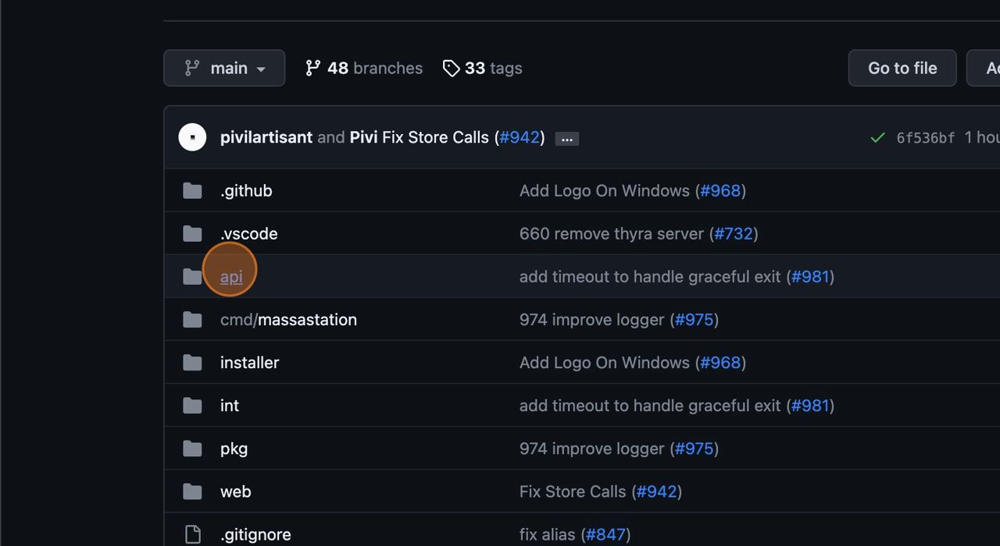

**2. Copy the whole content of `swagger.yml`**

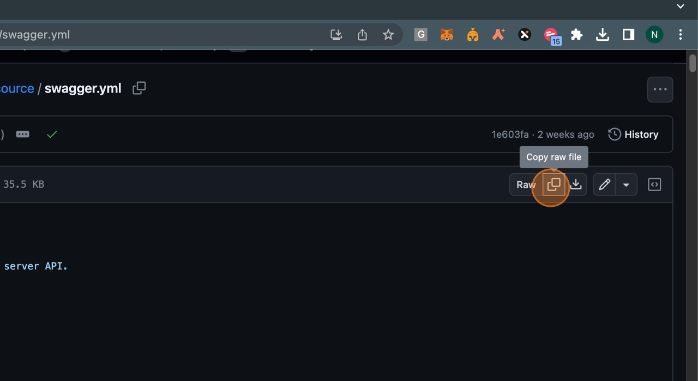

**3. You can also copy the content of `swagger.yml` directly from your local repository.**

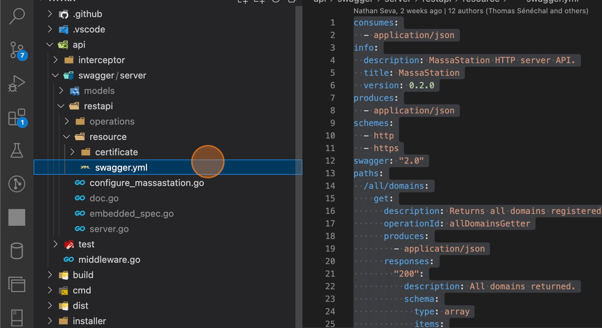

**4. Now, install and Open your Postman**

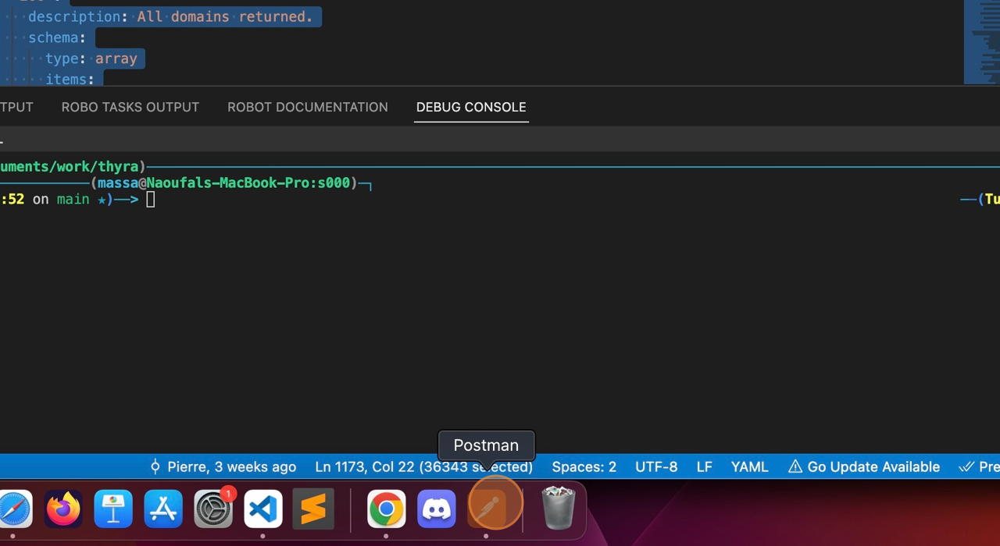

**5. Click on APIs**

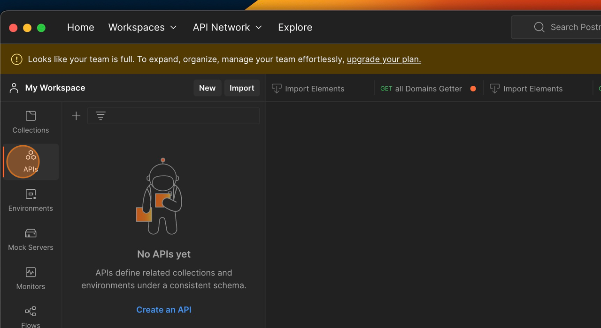

**6. Click on Import**

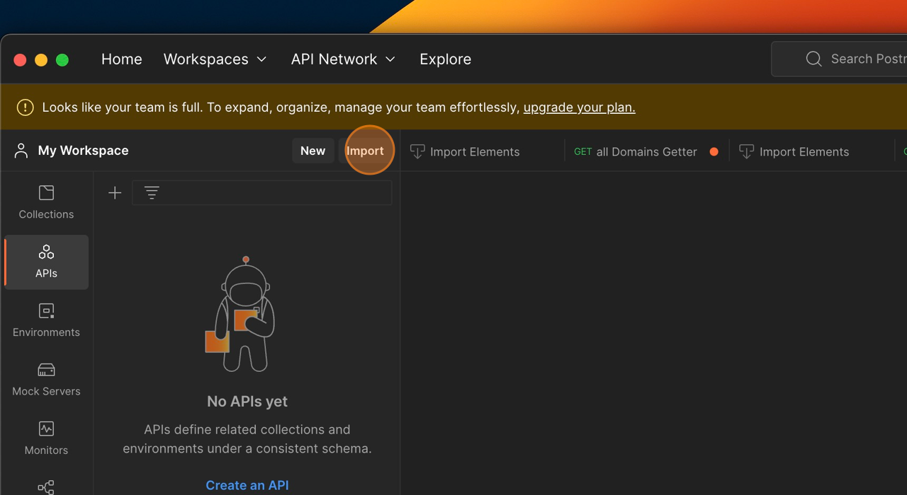

**7. Select Raw text**

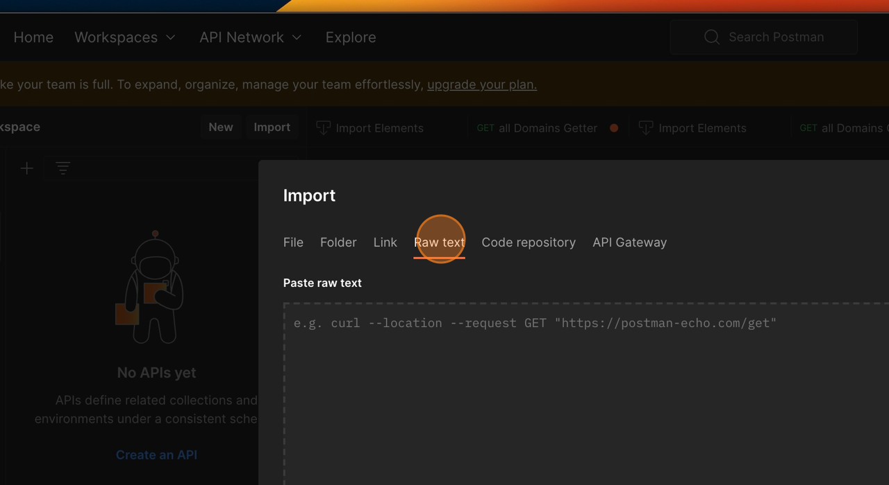

**8. Paste the content of the `swagger.yml`**

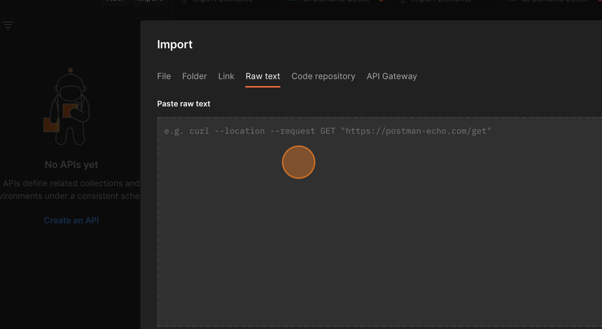

**9. Click on Continue**

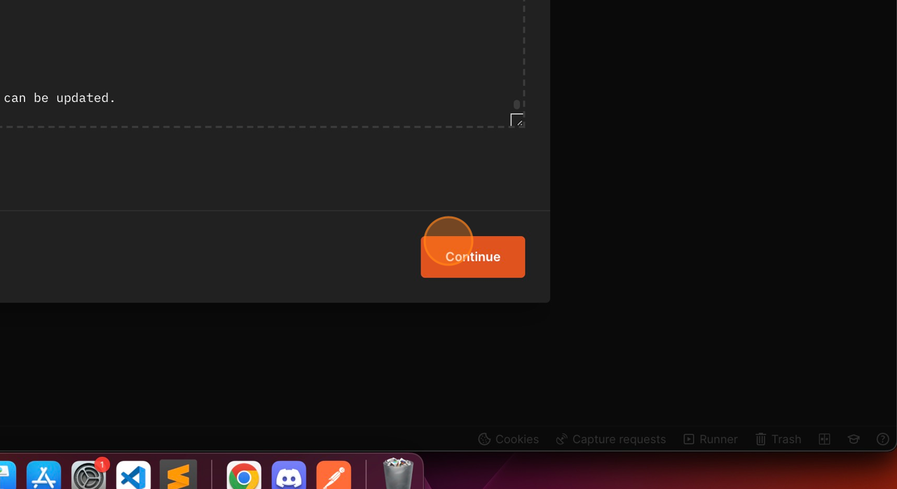

**10. Now Postman will detect MassaStation API and its type.**

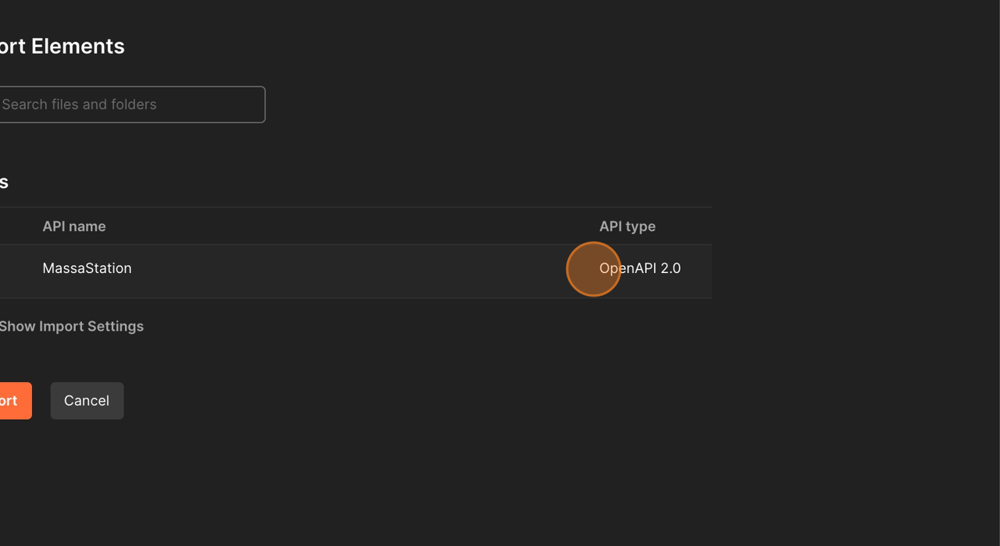

**11. Click Import and wait**

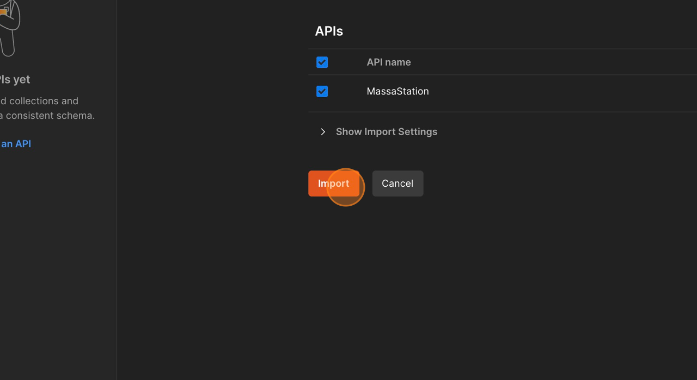

**12. When Import is Done, you will be able to see MassaStation API imported, and you can browse all its endpoints**

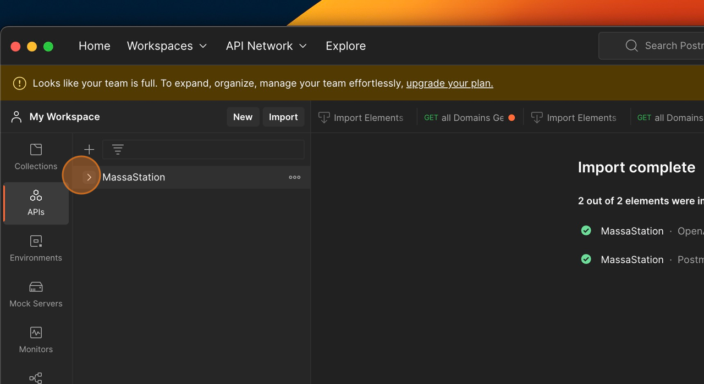

**13. Let's try to call an endpoint, but before you should have your massa station running in the background. You can run it directly from the terminal, inside station repo, type `task build-run`**

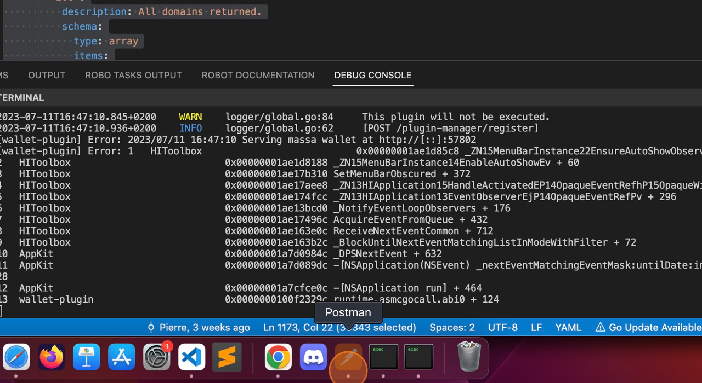

**14. Expand MassaStation folder, and let's try to call an endpoint**

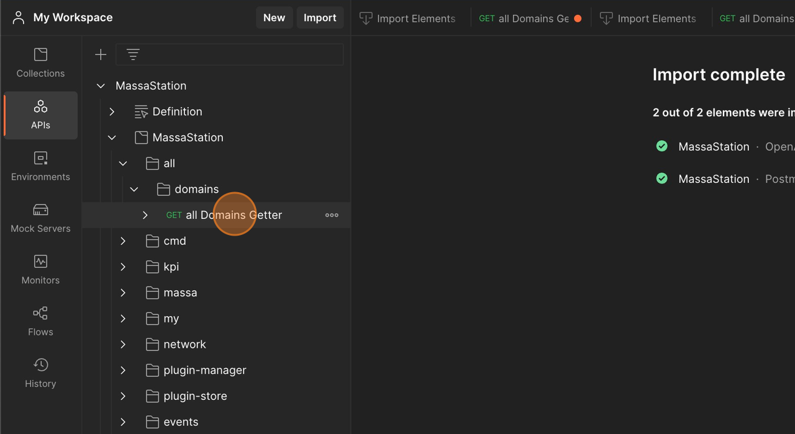

15. **Replace the `{{baseUrl}}` by `station.massa` or define it as an environment variable in Postman:**
   
   For more flexibility, define `baseUrl` as your own environment variable in Postman. This allows you to easily switch between different environments or server instances without modifying the requests individually.
   
   Refer to the [Postman documentation](https://learning.postman.com/docs/sending-requests/variables/) for details on defining and managing environment variables in Postman.

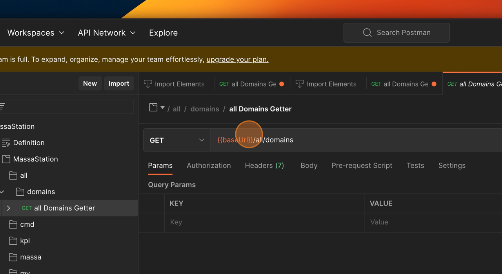

**16. Click on Send, and wait a few seconds...**

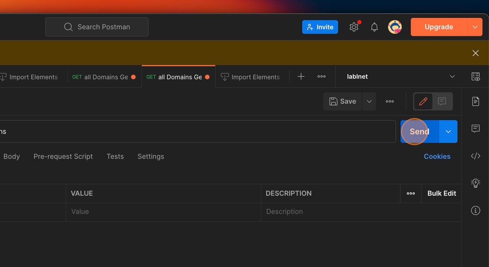

**17. You will receive in response all websites uploaded so far to the current DNS.**

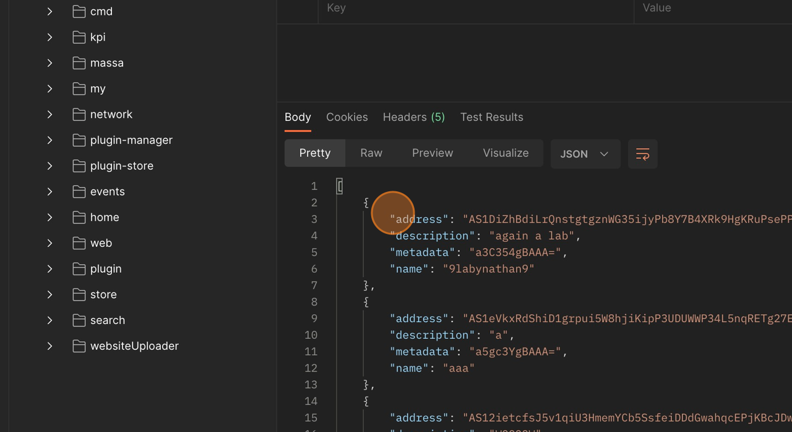
